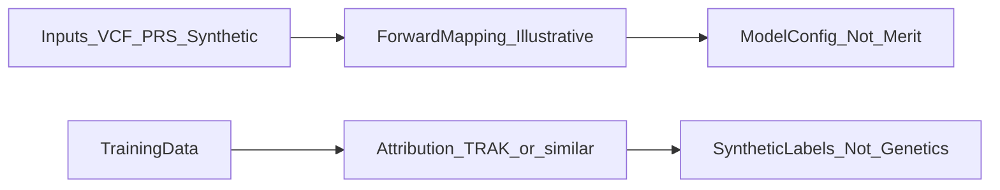

# Ethics and responsible use

## Purpose

This document describes ethical boundaries, known risks, and design principles for **Seance** (the “genomic features ↔ model configuration / attribution” framework in this repository). It applies to all code, examples, demos, and releases unless a narrower scope is explicitly stated.

This is **not** legal advice, medical advice, or a substitute for institutional review, privacy impact assessment, or counsel where you process sensitive personal or genomic data.

## Project intent

Seance is a **research and engineering framework**: parsers, feature summaries, optional mappings to model hyperparameters, and tooling to explore **data attribution** (for example influence-style or TRAK-style methods). It exists to study software integration and methods—not to deliver a validated clinical product, consumer genetics service, or proof that **genomes determine aptitude for building or using AI systems**.

## Non-goals and prohibited interpretations

Do **not** use this project to assert or imply that:

- Any genotype, polygenic score (PRS), or ancestry is **better or worse** for designing, training, or operating AI systems.
- People or groups can be **ranked by genetic suitability** for machine learning work or cognitive work in general.
- Outputs are suitable for **diagnosis, treatment, employment decisions, insurance, or educational placement**.

PRS for cognitive, educational, or behavioral traits are **statistical summaries** from population data. They are **not** causal explanations of any individual’s abilities or worth. Unless separately validated and peer-reviewed under clear scope, any mapping from such scores (or from VCF-derived features) to model configuration in this repository should be treated as **illustrative and experimental**, not as optimization of real-world training pipelines based on biology.

## Forward Seance (genomic features → model configuration)

**Limitations of inputs**

- Variant calls and PRS depend on **reference panel, quality filters, and population**; portability across ancestries is limited.
- For complex traits, **individual-level prediction** is typically weak; uncertainty is large.
- Correlations in data are **not** proof of mechanism or destiny.

**Defaults and documentation**

- Public examples and defaults should prefer **synthetic or clearly labeled** inputs until any path that accepts real human data is implemented with matching safeguards and documentation.
- If support for real files (for example VCF) is added: prefer **local processing** on the user’s machine, **no silent uploads** to third parties, and clear notice that **lawful basis, consent, and data agreements** are the user’s responsibility.

## Reverse Seance (attribution → “lineage”)

Methods such as TRAK or influence-style attribution attribute model behavior to **training data points** (or their gradients/features)—**not** to inherited DNA.

Entries in a **synthetic** “ancestor” or contributor registry are **labels for demonstration**. Rankings reflect **estimated influence of training examples** on a model output under a chosen method and setup. They are **not**:

- Measures of genetic relatedness,
- Moral “credit” or blame,
- Evidence that a person’s biology caused a model behavior.

Naming and UI should avoid suggesting biological ancestry or merit. When the CLI or docs present rankings, they should repeat that attribution is **about data influence**, not genetics.

## Conceptual separation (not architecture)

The following diagram is **conceptual** only: it separates illustrative genomic→config mapping from training-data attribution.

## Data governance (principles)

- **Consent** from a data subject is necessary for ethical use of their data but **does not** remove all risks or legal obligations.
- **Re-identification**: genomic data can sometimes be linked back to individuals or relatives even without a name; treat paths that touch real genotypes as **high sensitivity**.
- This open-source project **does not** sell user data. Maintainers and contributors should still avoid committing secrets, tokens, or user-uploaded files; see a future `SECURITY.md` if reporting vulnerabilities or handling credentials becomes relevant.
- Telemetry, if ever added, should be **opt-in**, documented, and minimal.

## Misuse and dual-use awareness

Harmful uses include **discrimination**, **eugenic narratives**, **employer or school screening** using genomic or PRS outputs, or framing any score as “optimizing” humans. Documentation and, where applicable, CLI defaults and warnings should **reduce** readings that tie genetics to intelligence or AI merit.

## Reporting concerns

If you believe this project’s code or documentation enables harm, encourages misuse, or needs a correction: open a **GitHub Issue** on this repository (use a clear title such as “Ethics: …”) or contact the maintainers through the channel listed in the repository **README**. Replace this sentence with a dedicated email or policy link when available.

## Maintenance

Any change that affects **genomic input handling, PRS-related messaging, or attribution UX/copy** should update this file or a clearly linked doc so that ethics constraints stay accurate. The **[README](README.md)** summarizes key points and links here.