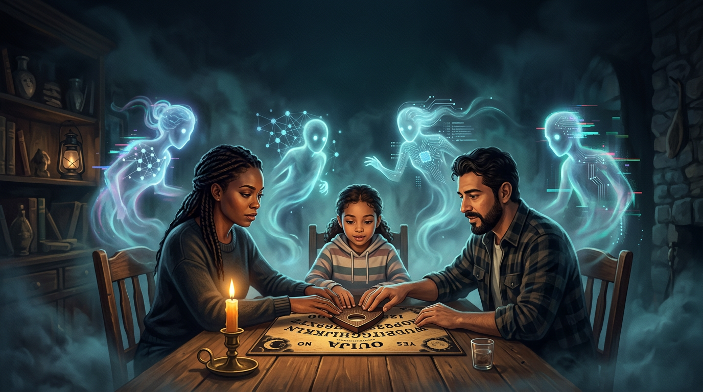

# Seance

Bi-directional bridge experiments between genomic-style features and neural model configuration, plus attribution-style tooling (“reverse Seance”). Scope and technical goals are described in [AGENTS.md](AGENTS.md).

**Ethics:** This project must not be used to claim that any genotype or polygenic score makes someone “better” or “worse” at AI or cognition. Attribution methods score **training data influence**, not inherited biology. Read the full boundaries, risks, and principles in **[ETHICS.md](ETHICS.md)** before using or extending the code.